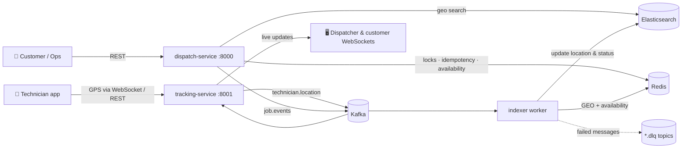
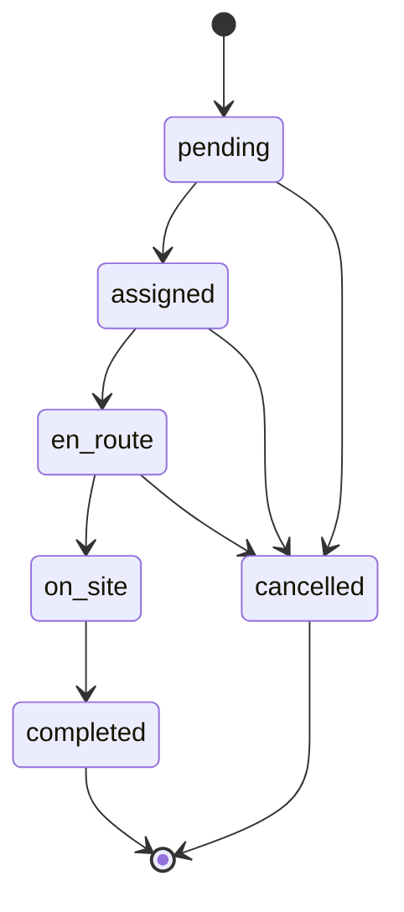
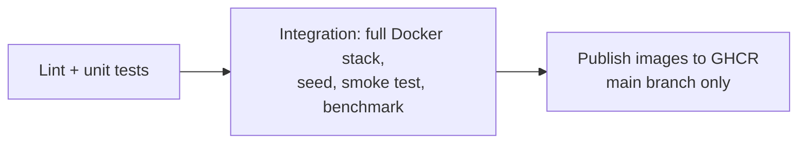

# 🛠️ Real-Time Field Service Dispatch Platform

[](https://github.com/DanKan0517-then/field-dispatch/actions/workflows/ci.yml)


A distributed backend that **finds the nearest available technician for a service request, assigns them safely under heavy concurrency, and streams their live location and job status** to dispatchers and customers in real time.

Built to handle **10,000+ technicians** and **100,000+ service requests**.

---

## 📌 Table of Contents
1. [What it does](#-what-it-does)
2. [Architecture](#-architecture)
3. [Tech stack](#-tech-stack)
4. [How the hard problems are solved](#-how-the-hard-problems-are-solved)
5. [Project structure](#-project-structure)
6. [Getting started](#-getting-started)
7. [API reference](#-api-reference)
8. [Real-time WebSockets](#-real-time-websockets)
9. [Job lifecycle](#-job-lifecycle)
10. [Benchmarks](#-benchmarks)
11. [Testing & CI/CD](#-testing--cicd)
12. [Troubleshooting](#-troubleshooting)

---

## ✨ What it does

| Step | What happens |
|---|---|
| 1. Customer raises a request | `POST /jobs` creates a job. An **Idempotency-Key** makes sure a retried request never creates a duplicate job. |
| 2. System finds technicians | Elasticsearch **geo search** finds technicians near the job with the right skill; Redis filters out anyone busy. |
| 3. Job gets assigned | A **distributed lock** on the job plus an **atomic claim** on the technician guarantee no double assignment. |
| 4. Technician moves | The technician app streams GPS over **WebSocket**; updates flow through **Kafka**. |
| 5. Everyone sees it live | Dispatchers and customers receive live location + status updates over **WebSockets**. |

---

## 🏗️ Architecture



### Services

| Service | Port | Responsibility |
|---|---|---|
| **dispatch** | 8000 | Create jobs, search technicians, assign nearest available, manage job status |
| **tracking** | 8001 | Receive technician GPS, broadcast location & job updates over WebSockets |
| **indexer** | – | Kafka consumer that keeps Elasticsearch and Redis in sync, with retries and a dead-letter queue |

---

## 🧰 Tech stack

| Layer | Technology | Why |
|---|---|---|
| API | **FastAPI** (async Python 3.12) | High-throughput async I/O, auto-generated docs |
| Messaging | **Apache Kafka** (KRaft mode) | Durable, ordered event streams per technician / job |
| Cache & coordination | **Redis 7** | Availability sets, GEO index, distributed locks, idempotency keys |
| Search | **Elasticsearch 8** | `geo_point` distance filtering and sorting at scale |
| Real-time | **WebSockets** | Push location & status to clients instantly |
| Resilience | Custom circuit breaker + **tenacity** retries | Survive downstream outages gracefully |
| DevOps | **Docker Compose**, **GitHub Actions**, **GHCR** | One-command local stack, automated test → integration → publish |

---

## 🧠 How the hard problems are solved

<details>
<summary><b>🔍 Fast technician search (geospatial indexing)</b></summary>

Technicians are stored in Elasticsearch as `geo_point` documents. A search uses a `geo_distance` filter plus a `_geo_distance` sort, so only nearby technicians are ever scanned. Results are then filtered against Redis availability in a single `SMISMEMBER` call.

A `?strategy=naive` mode (loads every technician and computes distance in Python) is included as a baseline so the speed-up can be measured.
</details>

<details>
<summary><b>🔒 No double assignments (distributed locks + atomic claims)</b></summary>

- **Per job:** a Redis lock (`SET NX PX`) with a token-checked Lua release. Two requests assigning the same job can't run at once, and a lock can only be released by whoever holds it.
- **Per technician:** available technicians live in a Redis set. Assignment claims one with `SREM`, which is atomic — if 20 requests race for the same technician, exactly one wins.
</details>

<details>
<summary><b>🔁 Safe retries (idempotency keys)</b></summary>

`POST /jobs` requires an `Idempotency-Key` header.
- First request → processed and response cached for 24h.
- Same key again → the **same job** is returned, nothing new created.
- Same key while the first is still running → `409 Conflict`.
</details>

<details>
<summary><b>📨 Reliable event processing (Kafka)</b></summary>

- Messages are keyed by technician / job id so updates for one entity stay **in order**.
- Offsets are committed **only after** a message is handled → at-least-once delivery.
- Failed messages retry with **exponential backoff**; malformed messages skip retries.
- Anything that still fails goes to a **dead-letter topic** (`<topic>.dlq`) for inspection.
- Duplicate deliveries are ignored via event-id **deduplication** in Redis.
- Crashed consumers are **automatically restarted** with backoff.
</details>

<details>
<summary><b>🛡️ Fault tolerance (circuit breakers + fallbacks)</b></summary>

- If Elasticsearch fails repeatedly, its circuit breaker **opens** and search **falls back to Redis `GEOSEARCH`** — dispatch keeps working.
- Kafka produces and Elasticsearch writes are wrapped in breakers + retries too.
- If publishing an assignment event fails, the system **rolls back**: the technician returns to the pool and the job goes back to `pending`.
</details>

---

## 📁 Project structure

```
field-dispatch/
├── common/dispatch_common/      # Shared library used by all services
│   ├── availability.py          #   Redis availability, skills, GEO
│   ├── idempotency.py           #   Idempotency-Key store
│   ├── locks.py                 #   Distributed lock
│   ├── resilience.py            #   Circuit breaker + retry policy
│   ├── kafka.py                 #   Producer, consumer loop, DLQ, supervisor
│   ├── events.py                #   Event schemas & topic names
│   └── search_index.py          #   Elasticsearch index mapping
├── services/
│   ├── dispatch/                # Job + assignment API
│   ├── tracking/                # GPS ingest + WebSocket fan-out
│   └── indexer/                 # Kafka → Elasticsearch/Redis sync worker
├── scripts/
│   ├── seed.py                  # Load 10K test technicians
│   ├── bench.py                 # Latency benchmark
│   └── smoke.sh                 # End-to-end check
├── tests/                       # Unit tests
├── .github/workflows/ci.yml     # CI/CD pipeline
└── docker-compose.yml           # Full local stack
```

---

## 🚀 Getting started

### Prerequisites
- **Docker** + Docker Compose v2
- **Python 3.11+**
- ~3 GB free RAM (Elasticsearch + Kafka)

### 1. Clone
```bash
git clone https://github.com/DanKan0517-then/field-dispatch.git
cd field-dispatch
```

### 2. Start everything
```bash
docker compose up -d --build --wait
```
This starts Kafka, Redis, Elasticsearch and all three services, and waits until they're healthy.

### 3. Load test data
```bash
pip install -e common -r requirements-dev.txt
python scripts/seed.py --count 10000 --reset
```
Creates 10,000 technicians with random skills around Bengaluru.

### 4. Check it works
```bash
bash scripts/smoke.sh
```
Expected output ends with: `smoke test passed`

### 5. Explore the APIs
- Dispatch docs: http://localhost:8000/docs
- Tracking docs: http://localhost:8001/docs

### Stop
```bash
docker compose down -v
```

---

## 📡 API reference

### Dispatch service (`:8000`)

| Method | Endpoint | Description |
|---|---|---|
| `POST` | `/jobs` | Create a job (header `Idempotency-Key` required) |
| `GET` | `/jobs/{job_id}` | Get a job |
| `POST` | `/jobs/{job_id}/assign?radius_km=15` | Assign nearest available technician |
| `POST` | `/jobs/{job_id}/status` | Update status: `en_route`, `on_site`, `completed`, `cancelled` |
| `GET` | `/technicians/search?lat=&lon=&radius_km=&skill=` | Find nearby available technicians |
| `GET` | `/health` | Health + circuit-breaker state |

### Tracking service (`:8001`)

| Method | Endpoint | Description |
|---|---|---|
| `POST` | `/technicians/{id}/location` | Send one GPS update |
| `GET` | `/health` | Health + open WebSocket count |

### Example

```bash
# 1. Create a job
curl -X POST localhost:8000/jobs \
  -H "Idempotency-Key: $(uuidgen)" \
  -H "Content-Type: application/json" \
  -d '{"customer_id":"c-42","lat":12.97,"lon":77.59,"skill":"plumbing"}'

# 2. Assign it (use the job_id returned above)
curl -X POST "localhost:8000/jobs/<job_id>/assign?radius_km=10"

# 3. Technician is on the way
curl -X POST localhost:8000/jobs/<job_id>/status \
  -H "Content-Type: application/json" -d '{"status":"en_route"}'
```

Skills available in test data: `hvac`, `plumbing`, `electrical`, `appliance`, `network`.

---

## ⚡ Real-time WebSockets

| URL | Who uses it | Receives |
|---|---|---|
| `ws://localhost:8001/ws/dispatch` | Dispatcher console | Every location + job event |
| `ws://localhost:8001/ws/jobs/{job_id}` | Customer tracking page | That job's status + its technician's location |
| `ws://localhost:8001/ws/technicians/{tech_id}` | Technician app | Sends `{"lat": .., "lon": ..}` |

Quick test with [websocat](https://github.com/vi/websocat):
```bash
websocat ws://localhost:8001/ws/dispatch
```

---

## 🔄 Job lifecycle


Invalid transitions return `409 Conflict`. When a job is completed or cancelled, the technician automatically becomes available again.

---

## 📊 Benchmarks

```bash
python scripts/bench.py --searches 5000 --jobs 2000 --concurrency 50
```

Compares naive full-scan search with Elasticsearch geo search + Redis availability, and measures assignment latency under concurrent load.

| Scenario | Requests | Mean (ms) | p50 | p95 | p99 |
|---|---|---|---|---|---|
| Search — naive scan | | | | | |
| Search — ES geo + Redis | | | | | |
| Assign (lock + claim + event) | | | | | |

> Fill in with your own run. Results depend on hardware.

---

## ✅ Testing & CI/CD

```bash
ruff check .   # lint
pytest -q      # unit tests
```

Unit tests cover the circuit breaker, distributed lock, idempotency store, concurrent technician claims, and Kafka retry / DLQ handling.

**GitHub Actions pipeline** (on every push and PR):



---

## 🩺 Troubleshooting

| Problem | Fix |
|---|---|
| Elasticsearch exits immediately | Give Docker more memory (≥ 4 GB), or on Linux run `sudo sysctl -w vm.max_map_count=262144` |
| `503 No available technician` | Run the seed script, or increase `radius_km` |
| Port already in use | Stop whatever uses 8000 / 8001 / 6379 / 9200 / 29092 |
| Search returns `redis-geo-fallback` | Elasticsearch is down or starting — the circuit breaker switched to Redis |

---

## 👤 Author

**Dhanushkanth Balasubramanian** — [@DanKan0517-then](https://github.com/DanKan0517-then).


